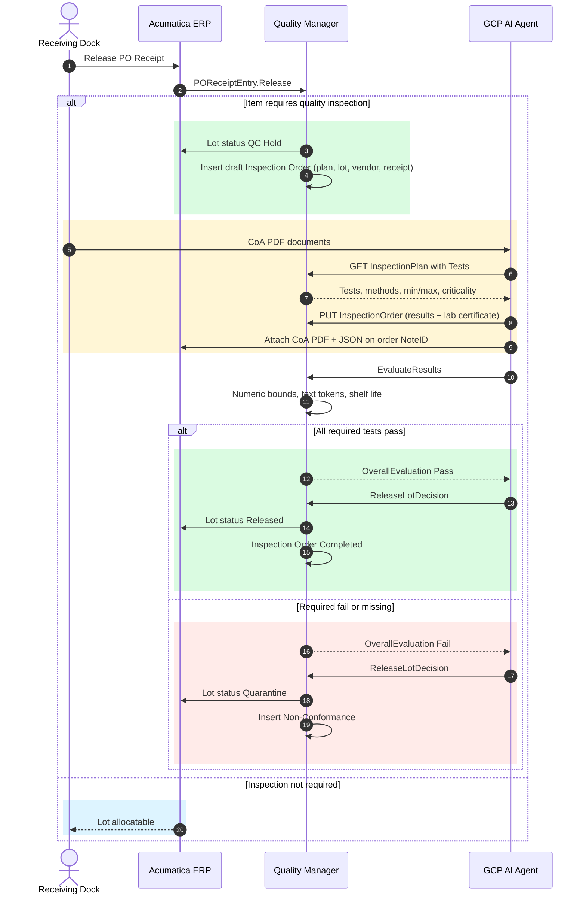

# CanNordic BioNutra Inc. (`acu-gitops-qms`)

Virgin-tenant Acumatica seed for **CanNordic BioNutra Inc.** (AcctCD `CNBN`), a
Canadian CDMO and ingredient importer (NHPs, functional foods). Finance +
inventory/distribution. Kit stock items, kit specifications, and kit-assembly
numbering are not seeded. `acu run` does not assemble or sell kits. QMS tenant for
[`gcp-acu-coa`](https://github.com/kborovik/gcp-acu-coa). Single full seed — no `--flavor`.

Sourced from the company profile and master data in
[`gcp-acu-coa`](https://github.com/kborovik/gcp-acu-coa/blob/main/domain/COMPANY_PROFILE.md).
Inventory and vendor IDs are the domain catalog IDs (length at most 30). Warehouse
`SiteCD` stays 10 characters (`WH-MISS-01`).

`config/bootstrap/segmented-key.yaml` raises CS202000 `INVENTORY` and
`BIZACCT` segment 1 to length 30 (DAC max) before StockItem / Vendor /
Customer. `ACCOUNT` and `INSITE` stay 10.

**Start from a brand-new empty tenant.** Do not apply onto a half-configured company.

`acu tenant create` publishes AcuBootstrap so
Company maps CS101500 `DecPlQty` (this seed sets 3 for milligram-scale KG
quantities), SegmentedKey maps `Length` to CS202000 `Detail`, and Role
`AssignUser` persists `UsersInRoles`. Do not use `acu check` (cold-lifecycle
subcommand; going away).

## Rebuild order

One shot: `gmake rebuild`. Acu recipes are `acu-*`; Lab5.QMS recipes are `qms-*`. Steps:

```sh
# 1. Credentials in .env (ACU_PASSWORD, ACU_TENANT, ACU_BASE_URL, ACU_API_VERSION)
gmake acu-preflight

# 2. Recreate empty tenant (create = first-login + AcuBootstrap)
gmake acu-delete
gmake acu-create

# 3. Seed config umbrella (bootstrap → baseline → setup → master)
gmake acu-apply

# 4. Lifecycle scenarios (once capital → buy)
gmake acu-run

# 5. Publish pinned Lab5.QMS (sibling checkout at pin tag; this repo does not compile)
gmake qms-publish
# pin: customization/Lab5.QMS.pin → GitHub release kborovik/acu-custom-qms
# override checkout: gmake qms-publish QMS_SRC=/path/to/acu-custom-qms

# 6. Post-publish: QORD/QNCR numbering + inspection plans + UsrQMS* + Quality Manager users
gmake qms-apply

# 7. Prove no drift (SEED_DIRS only; config/qms/ is post-publish)
gmake acu-diff

# 8. Capture derived-state observations (EndingBalance trial-balance)
gmake acu-state
# warm gate: once-capital only — additive buy moves numeric observations
acu run scenario/10-seed-capital.yaml && acu state --assert-unchanged

# Optional: re-seed from live (inverse of apply; always under config/)
# acu extract --out . --force
```

Bare `acu apply` / `acu diff` also prefer `config/` when those trees exist.
`acu extract` hard-cuts emit to `config/{bootstrap,baseline,setup,master}/` (never root SEED_DIRS).
`config/qms/` is not a SEED_DIR — apply it only after Lab5.QMS is published.
`gmake acu-apply` and `gmake acu-run` succeed on a virgin tenant before Lab5.QMS is published.

Lab5.QMS is not compiled here. `customization/Lab5.QMS.pin` names the GitHub
release zip (`tag` + `sha256`). `gmake qms-publish` runs `acuqms deploy` from
`QMS_SRC` (default `../acu-custom-qms`) only when that checkout's version
matches the pin. `gmake qms-fetch` downloads the pinned release asset into
`.cache/` and checks the digest. `gmake qms-update` resolves the latest
GitHub release, rewrites the pin `tag` + `sha256`, and downloads that zip.

`config/qms/05-numbering-sequences.yaml` seeds Bootstrap `NumberingSequence` `QORD` / `QNCR` (inspection orders / NCR). `config/qms/10-inspection-plans.yaml` and `config/qms/20-stock-item-qms.yaml` set `endpoint: QMS/22.200.001`. `acu apply` of those files persists InspectionPlan rows and `UsrQMSInspectionRequired`, `UsrQMSInspectionPlanID`, and `UsrMinShelfLifeDays`. `config/qms/30-qm-role-users.yaml` applies.

## Company

| | |
| --- | --- |
| Legal name | CanNordic BioNutra Inc. / BioNutra CanNordique |
| AcctCD | `CNBN` |
| Base currency | CAD |
| Country | CA |
| HQ | 2450 Meadowpine Blvd, Mississauga, ON L5N 6S2 |
| Site licence | Health Canada #302194 (Mfg / Pack / Label / Import) |

Warehouse: `WH-MISS-01`. Locations: `MAIN` (general), `QCHOLD` (receipts; no
sales/assembly), `READY` (released stock), `QUARANTINE` (failed inspection;
transfers only). Receiving default `QCHOLD`; shipping default `READY`. Buy
receipts land in `QCHOLD`.

Item class IDs stay `PARTS` / `KITS` so `acu extract` filter-split still matches.

## Catalog in this seed

| ID | Kind |
| --- | --- |
| `VEND-NORTH-BIO` | vendor |
| `VEND-ALPINE-EXT` | vendor |
| `VEND-NIPPON-PHARMA` | vendor |
| `VEND-NORDIC-MAR` | vendor |
| `RAW-ECH-EXT4` | raw (lot `LOTRAW`, plan `PLAN-ECH-EXT4`) |
| `RAW-ELD-EXT10` | raw (lot `LOTRAW`, plan `PLAN-ELD-EXT10`) |
| `RAW-ASH-EXT5` | raw (lot `LOTRAW`, plan `PLAN-ASH-EXT5`) |
| `RAW-COQ10-99` | raw (lot `LOTRAW`, plan `PLAN-COQ10-99`) |
| `RAW-OMEGA3-70` | raw (lot `LOTRAW`, plan `PLAN-OMEGA3-70`) |
| `RAW-ASTA-10` | raw (lot `LOTRAW`, plan `PLAN-ASTA-10`) |
| `VITALPLUS` | customer |
| `HEARTLAB` | customer |
| `WELLCAN` | customer |
| `LOTRAW` | lot/serial class for raw (When Received, user-enterable, expiry) |
| `NOTRACK` | lot/serial class for kits (Not Tracked; required while LotSerialTracking is on) |
| `QORD` / `QNCR` | numbering (inspection orders / NCR) |

## Layout

| Path | Role |
|------|------|
| `.env` | Secrets + REST where (`ACU_BASE_URL`) + Default pin (`ACU_API_VERSION`) |
| `customization/Lab5.QMS.pin` | Pinned Lab5.QMS GitHub release (tag + sha256). Not the zip |
| `Makefile` | `gmake rebuild` / `acu-*` / `qms-*` — never `acu check` |
| `config/bootstrap/` | Company identity, features, credit terms, segmented keys (Bootstrap contract is package SoT — never scaffolded) |
| `config/baseline/` | GL foundation (COA, ledger, subaccounts, UOMs, company packaging `91-company-packaging`) |
| `config/setup/` | Financial year, master calendar, open periods |
| `config/master/` | Numbering (`05-numbering-sequences`) before module prefs; `LOTRAW`; inventory, warehouse, items, vendors, customers; roles/users (`90-roles` then `91-users` then `92-role-users`) |
| `config/qms/` | Post-publish Lab5.QMS: `QORD`/`QNCR` numbering, inspection plans, StockItem UsrQMS*, Quality Manager user attach. Not SEED_DIRS |
| `scenario/10-seed-capital.yaml` | Once-class owner capital JE (skip-if-present when present); Period = `${current_period}` |
| `scenario/20-buy.yaml` | Additive ingredient PO, then receipt (lot + expiry at `QCHOLD`), then bill, then AP pay (four suppliers) |
| `config/views/10-trial-balance.yaml` | Observer view (EndingBalance inquire; Period pinned literal; not SEED_DIRS) |
| `state/` | Written by `acu state` (derived-state observations) |

`acu run` expands `${current_period}` to host-local `MMyyyy`. Views for `acu state` stay pinned so committed `state/` rows do not rewrite every month.

Monoscenario `buy-sell` is not part of this package.

## Personas

| User | Role | ERP roles |
| --- | --- | --- |
| `qa-director` | Dr. Elodie Tremblay, Director of QA | IN Manager, PO Viewer (+ Quality Manager after `config/qms/`) |
| `vp-supply-chain` | Marcus Vance, VP Supply Chain | PO Admin, SO Admin |
| `receiving-supervisor` | Devon Singh, Receiving Supervisor | IN Receiver, PO Clerk |
| `erp-architect` | Sophie Archambault, ERP Architect | Administrator |
| `llm-agent` | LLM Agent | LLM Agent (+ Quality Manager after `config/qms/`) |

## Quality inspection workflow

From [`acu-custom-qms`](https://github.com/kborovik/acu-custom-qms). Actors:
**Receiving Dock**, **Acumatica ERP**, **Quality Manager**, **GCP AI Agent**.
Same path as graph actions and `QMS/22.200.001` REST. QC Hold becomes Released
only as role **Quality Manager** or as the ingestion service account
(`qms-ingestion`). A Quality Manager can also **Evaluate** and **Release Lot
Decision** from Inspection Orders (`QM.30.10.00`).



Lot status on inspected receipts is one of **QC Hold**, **Released**, or
**Quarantine**. Transfer failed lots to warehouse location `QUARANTINE`.
The receipt number, lot serial, and inspection order stay linked for the
life of the lot. The attached CoA PDF and parsed JSON stay on the order as
the audit record.
